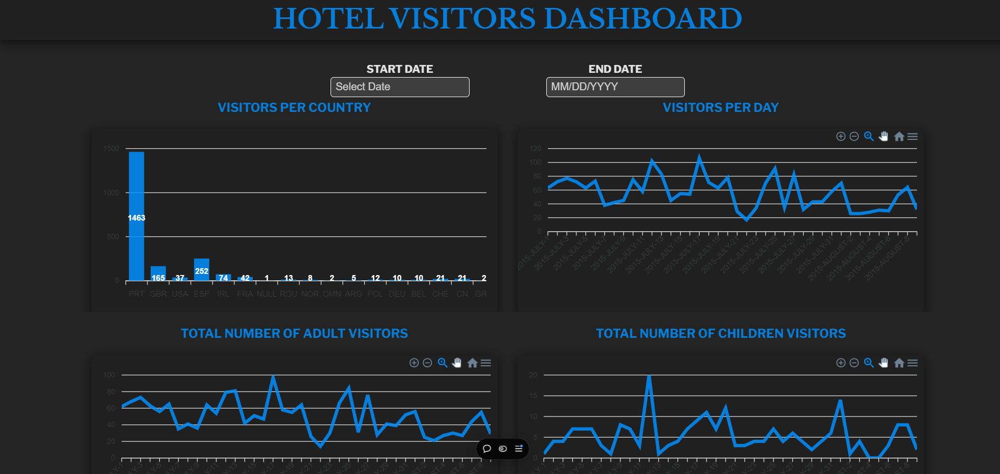

# Dashboard for hotel visitors

### This project is a data visualization dashboard built using React, where data is fetched from a CSV file and displayed in various charts. The CSV data contains information about hotel bookings, including the arrival date, number of adults, children, and babies, and the country of the visitors.

### The dashboard allows users to filter data based on a specific date range and visualize:

#### Visitors per Day (Total number of adults, children, and babies)
#### Visitors per Country
#### Total Number of Adult Visitors
#### Total Number of Children Visitors
### Features:
CSV data parsing using PapaParse
Interactive DatePicker to filter data by date range
Dynamic charts using ApexCharts
Fully responsive design that adjusts to both desktop and mobile views
Dark mode for date picker and calendar widgets for better accessibility
Steps to Use:
Install dependencies using npm install.
Place your CSV file in the public directory.
Run the app using npm start.
Select a date range, and the charts will automatically update based on the filtered data.

### Preview Image


### Demo Video

[Watch the demo video](./assets/preview%20video.mp4)

## Typescript + React

This template provides a minimal setup to get React working in Vite with HMR and some ESLint rules.

Currently, two official plugins are available:

- [@vitejs/plugin-react](https://github.com/vitejs/vite-plugin-react/blob/main/packages/plugin-react/README.md) uses [Babel](https://babeljs.io/) for Fast Refresh
- [@vitejs/plugin-react-swc](https://github.com/vitejs/vite-plugin-react-swc) uses [SWC](https://swc.rs/) for Fast Refresh

## Expanding the ESLint configuration

If you are developing a production application, we recommend updating the configuration to enable type aware lint rules:

- Configure the top-level `parserOptions` property like this:

```js
export default tseslint.config({
  languageOptions: {
    // other options...
    parserOptions: {
      project: ['./tsconfig.node.json', './tsconfig.app.json'],
      tsconfigRootDir: import.meta.dirname,
    },
  },
})
```

- Replace `tseslint.configs.recommended` to `tseslint.configs.recommendedTypeChecked` or `tseslint.configs.strictTypeChecked`
- Optionally add `...tseslint.configs.stylisticTypeChecked`
- Install [eslint-plugin-react](https://github.com/jsx-eslint/eslint-plugin-react) and update the config:

```js
// eslint.config.js
import react from 'eslint-plugin-react'

export default tseslint.config({
  // Set the react version
  settings: { react: { version: '18.3' } },
  plugins: {
    // Add the react plugin
    react,
  },
  rules: {
    // other rules...
    // Enable its recommended rules
    ...react.configs.recommended.rules,
    ...react.configs['jsx-runtime'].rules,
  },
})
```
